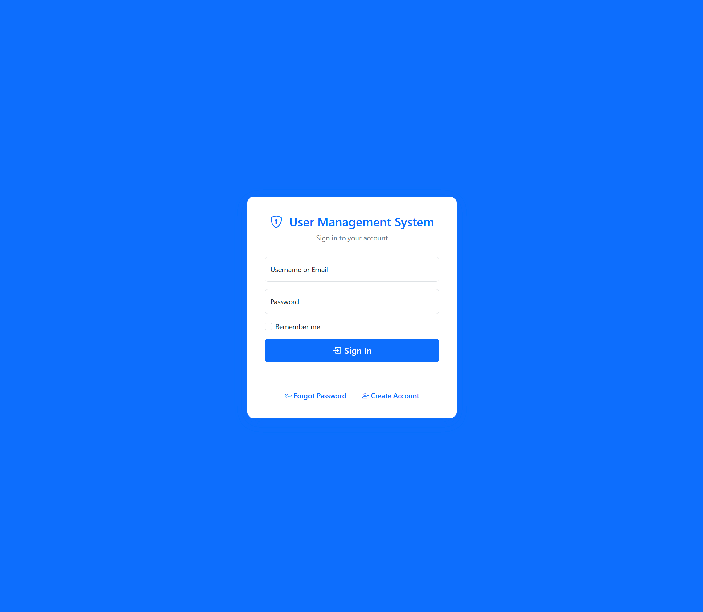
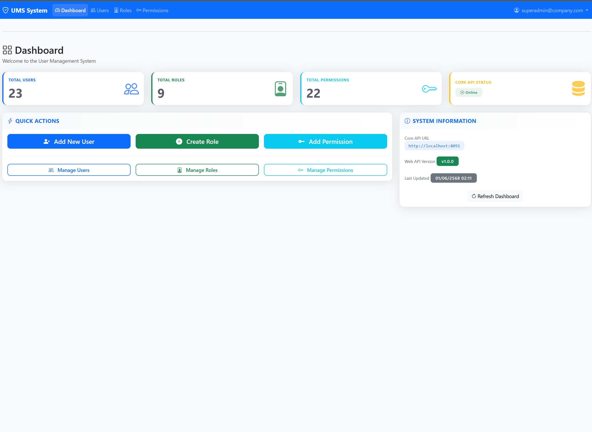
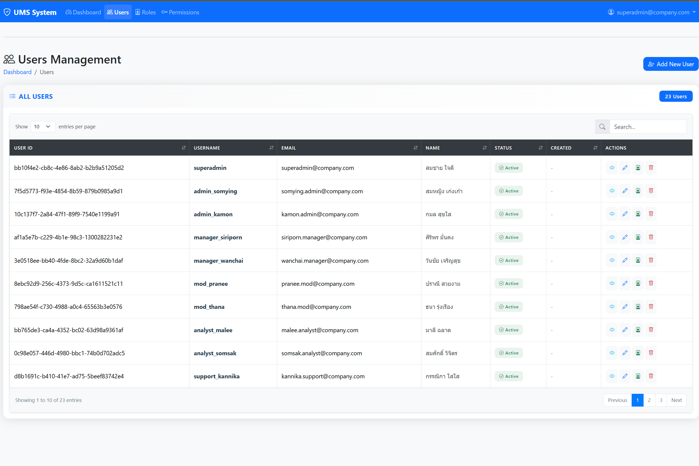
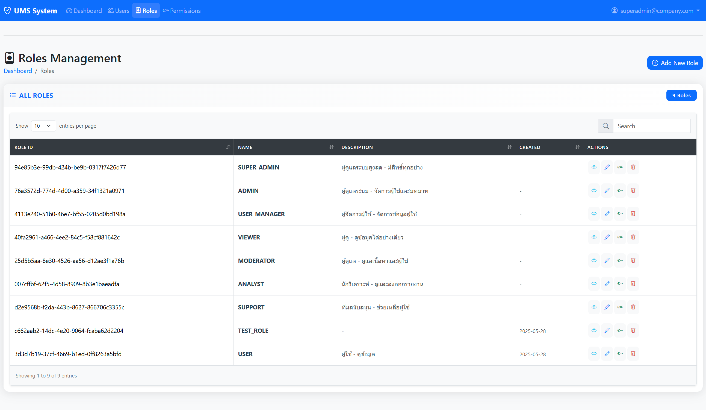

# User Management System


A Spring Boot application for managing users, roles, and permissions with session management, separated into 2 services (Web API, Core API).

## 📋 Table of Contents
- [User Management System](#user-management-system)
  - [📋 Table of Contents](#-table-of-contents)
  - [⭐ Highlights](#-highlights)
  - [🛠️ Key Technologies](#️-key-technologies)
  - [Project Structure](#project-structure)
  - [Features](#features)
  - [API Endpoints](#api-endpoints)
    - [Authentication](#authentication)
    - [User Management](#user-management)
    - [Role Management](#role-management)
  - [Security](#security)
  - [🚀 Getting Started](#-getting-started)
  - [⚙️ Configuration Guide](#️-configuration-guide)
    - [Environment-Specific Configuration](#environment-specific-configuration)
    - [Important Ports](#important-ports)
    - [Security Configuration](#security-configuration)
  - [⚠️ Known Limitations](#️-known-limitations)
  - [🎨 UI Screenshots](#-ui-screenshots)
    - [Login](#login)
    - [Dashboard](#dashboard)
    - [User Management](#user-management-1)
    - [Role Management](#role-management-1)

## ⭐ Highlights
- Modular architecture separating Proxy (web-api) and Core (core-api), ready for future microservices expansion
- Uses JPA + PostgreSQL
- Role/Permission-based access control system
- Passwords encrypted with BCrypt
- Includes Audit Log and Actuator Monitoring
- Session management with auto-timeout

## 🛠️ Key Technologies
- Java 21
- Spring Boot 3.x
- Spring Security
- Spring Data JPA
- Springdoc OpenAPI (Swagger UI)
- PostgreSQL
- Thymeleaf (web-api)

## Project Structure
```bash
mp-ums/
├── core-api/           # Core business logic and data access
│   ├── src/
│   │   ├── main/
│   │   │   ├── java/
│   │   │   └── resources/
│   │   └── test/
│   └── pom.xml
│
└── web-api/            # Web interface and REST endpoints
    ├── src/
    │   ├── main/
    │   │   ├── java/
    │   │   └── resources/
    │   └── test/
    └── pom.xml
```

## Features
- User Management (CRUD operations)
- Role-Based Access Control (RBAC)
- Permission Management
- Secure Session Management
- API Documentation with Swagger UI

## API Endpoints

### Authentication
- `POST /api/users/login` - Login with username/email and password
- `POST /api/sessions/validate` - Validate session token
- `POST /api/sessions/logout` - Logout and invalidate session

### User Management
- `GET /api/users` - List all users
- `POST /api/users/create` - Create new user
- `PUT /api/users/update` - Update user
- `DELETE /api/users/{id}` - Delete user
- `POST /api/users/assign-role` - Assign role to user

### Role Management
- `GET /api/roles` - List all roles
- `POST /api/roles/create` - Create new role
- `PUT /api/roles/update` - Update role
- `DELETE /api/roles/{id}` - Delete role
- `POST /api/roles/assign-permission` - Assign permission to role

## Security
- Password encryption using BCrypt
- Role-based access control
- Session-based authentication
- CSRF protection
- XSS prevention
- SQL injection prevention

## 🚀 Getting Started
1. Install Java 21, Maven, PostgreSQL
2. Edit database config file in core-api
3. Run Core API and Web API using `mvn spring-boot:run`
4. See API details at Swagger UI: http://localhost:8091/swagger-ui.html

## ⚙️ Configuration Guide

### Environment-Specific Configuration
- Development: `application-dev.properties`

### Important Ports
- Web API: 8081 (default)
- Core API: 8091 (default)

### Security Configuration
- Session timeout can be adjusted based on security requirements
- API timeout should be set according to network conditions and load
- All sensitive configuration should be externalized in production

## ⚠️ Known Limitations
- RBAC enforcement is currently role-based only. Fine-grained permission checks (resource/action level) are not fully implemented
- Some endpoints may be accessible to roles that should not have full access
- Dynamic permission assignment and revocation is not yet fully supported
- Further improvements to RBAC mapping and enforcement are planned

## 🎨 UI Screenshots

### Login

Simple and secure login page with email/username authentication.

### Dashboard

Main dashboard showing system statistics and quick actions.

### User Management

User listing page with role management and filtering options.

### Role Management

Role management interface for creating, editing, and assigning permissions to roles with a clear hierarchical view.
