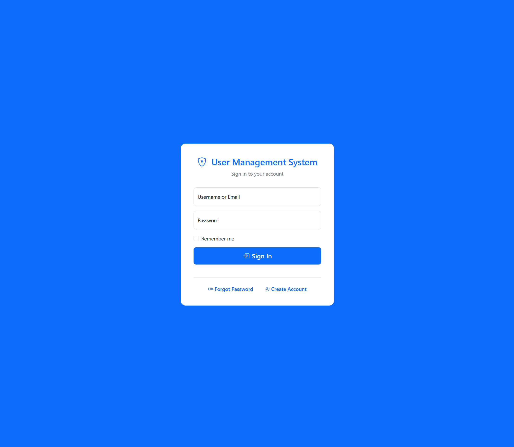
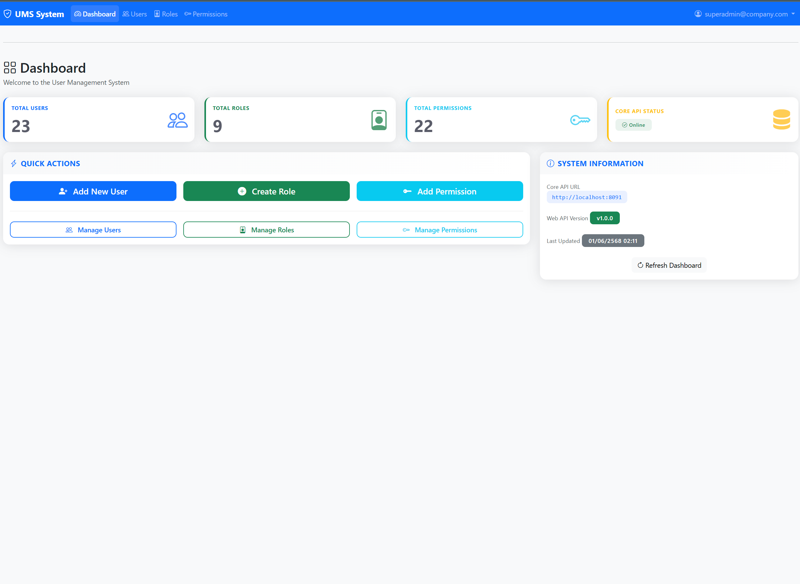
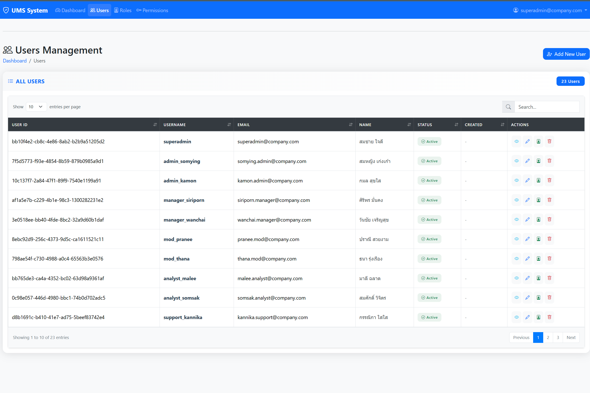
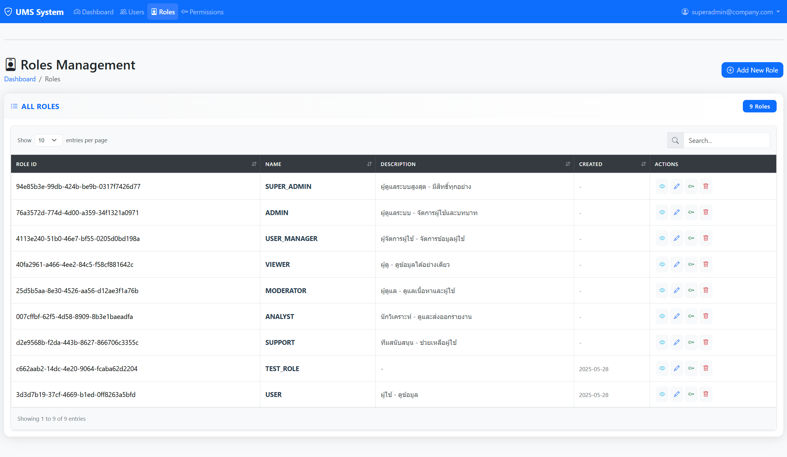

# User Management System with RBAC


A comprehensive Spring Boot application implementing Role-Based Access Control (RBAC) with fine-grained permissions, custom token authentication, and a modern service-oriented architecture. The system is separated into two independent services: Core API (backend) and Web API (frontend).

## Table of Contents
- [User Management System with RBAC](#user-management-system-with-rbac)
  - [Table of Contents](#table-of-contents)
  - [Highlights](#highlights)
  - [Key Features](#key-features)
  - [Architecture](#architecture)
  - [Key Technologies](#key-technologies)
  - [Project Structure](#project-structure)
  - [Security Features](#security-features)
  - [Getting Started](#getting-started)
    - [Prerequisites](#prerequisites)
    - [Installation](#installation)
    - [Running the Application](#running-the-application)
  - [Default User Accounts](#default-user-accounts)
  - [API Documentation](#api-documentation)
  - [Configuration Guide](#configuration-guide)
  - [Testing](#testing)
  - [Documentation](#documentation)
  - [UI Screenshots](#ui-screenshots)

## Highlights
- **Complete RBAC Implementation**: Fine-grained role and permission-based access control with custom token authentication
- **Modern Service Architecture**: Dedicated services per resource with comprehensive error handling
- **Secure by Design**: Custom TokenFilter, PermissionEvaluator, and stateless authentication
- **Two-Tier Architecture**: Separated Core API (backend) and Web API (frontend) for scalability
- **Production-Ready**: Full exception handling, logging, Docker support, and comprehensive documentation

## Key Features

### RBAC Security System
- **Custom Token Authentication**: UUID-based stateless token system with UserSession management
- **Fine-Grained Permissions**: Resource:Action permission model (e.g., USER:READ, ROLE:UPDATE)
- **Method Security**: `@PreAuthorize` with custom `PermissionEvaluator` for granular access control
- **Token Filter**: Custom `OncePerRequestFilter` for authentication and authority building
- **Stateless Sessions**: Configured with `SessionCreationPolicy.STATELESS`

### Service Layer Architecture
- **Dedicated Services**: UserWebService, RoleWebService, PermissionWebService
- **Comprehensive Error Handling**: HTTP status-specific exception translation
- **Thai Error Messages**: User-friendly error messages in Thai language
- **Clean Controllers**: No try-catch blocks, delegated to services
- **Easy Testing**: Mock services instead of HTTP clients

### Exception Handling
- **Global Exception Handler**: Centralized error handling with `@ControllerAdvice`
- **Custom Exceptions**: CoreApiClientException, SessionExpiredException, ValidationException
- **Error Response Format**: Consistent JSON structure with error codes
- **Flash Messages**: Redirect with user-friendly messages

### Developer Experience
- **Docker Support**: Full Docker Compose setup with PostgreSQL
- **API Documentation**: Swagger UI with detailed endpoint descriptions
- **Comprehensive Logging**: SLF4J with Logback (migrated from Log4j2)
- **Unit Tests**: Full test coverage for services and controllers
- **Local Documentation**: 33+ comprehensive guides (kept in local `/documentation` folder, not in repository)

## Architecture

### System Overview
```
┌─────────────────────────────────────────────────────────────┐
│                      Web API (Frontend)                      │
│  - Thymeleaf Templates                                      │
│  - Controllers (UserWebController, RoleWebController, etc.) │
│  - Dedicated Services (UserWebService, RoleWebService, etc.)│
│  - Exception Handlers (GlobalExceptionHandler)              │
│  - No Database                                               │
└────────────────────┬────────────────────────────────────────┘
                     │ REST API (HTTP)
                     ↓
┌─────────────────────────────────────────────────────────────┐
│                    Core API (Backend)                        │
│  - RESTful Controllers                                       │
│  - Service Layer (UserService, RoleService, etc.)           │
│  - Custom Security (TokenFilter, PermissionEvaluator)       │
│  - Repository Layer (JPA)                                    │
│  - PostgreSQL Database                                       │
└─────────────────────────────────────────────────────────────┘
```

### Security Flow
```
1. User Login
   ↓
2. Core API validates credentials
   ↓
3. Generate UUID token, store in UserSession
   ↓
4. Return token to Web API
   ↓
5. Web API stores token in session
   ↓
6. Subsequent requests include token
   ↓
7. TokenFilter validates token
   ↓
8. Load user with roles/permissions
   ↓
9. Build authorities (ROLE_, PERM_)
   ↓
10. PermissionEvaluator checks access
```

## Key Technologies

### Backend (Core API)
- Java 21
- Spring Boot 3.x
- Spring Security (Custom TokenFilter, PermissionEvaluator)
- Spring Data JPA
- PostgreSQL 16
- BCrypt Password Encoder
- SLF4J with Logback (Lombok @Slf4j)
- Lombok
- Swagger UI / OpenAPI

### Frontend (Web API)
- Spring Boot 3.x
- Thymeleaf 3.1
- Dedicated Service Layer
- Global Exception Handling
- RestTemplate for Core API communication
- No Database Connection

### Development & Deployment
- Maven 3.9.5
- Docker & Docker Compose
- Spring Boot Devtools
- JUnit 5 & Mockito

## Project Structure
```bash
spring-boot-user-management/
├── core-api/                    # Backend API Service
│   ├── src/
│   │   ├── main/
│   │   │   ├── java/com/mp/core/
│   │   │   │   ├── config/      # SecurityConfig.java
│   │   │   │   ├── controller/  # REST Controllers
│   │   │   │   ├── dto/         # Data Transfer Objects
│   │   │   │   ├── entity/      # JPA Entities
│   │   │   │   ├── exception/   # Custom Exceptions
│   │   │   │   ├── repository/  # JPA Repositories
│   │   │   │   ├── security/    # TokenFilter, PermissionEvaluator
│   │   │   │   ├── service/     # Business Logic
│   │   │   │   ├── util/        # Utility Classes
│   │   │   │   └── validation/  # Custom Validators
│   │   │   └── resources/
│   │   │       ├── application.properties
│   │   │       ├── application-dev.properties
│   │   │       └── application-docker.properties
│   │   └── test/                # Unit Tests
│   ├── Dockerfile
│   └── pom.xml
│
├── web-api/                     # Frontend UI Service
│   ├── src/
│   │   ├── main/
│   │   │   ├── java/com/mp/web/
│   │   │   │   ├── config/      # Configuration Classes
│   │   │   │   ├── controller/  # MVC Controllers
│   │   │   │   ├── dto/         # Data Transfer Objects
│   │   │   │   ├── exception/   # CoreApiClientException, etc.
│   │   │   │   ├── mapper/      # Object Mappers
│   │   │   │   ├── model/       # Domain Models
│   │   │   │   ├── security/    # Session Security
│   │   │   │   ├── service/     # UserWebService, RoleWebService, etc.
│   │   │   │   └── utils/       # Utility Classes
│   │   │   └── resources/
│   │   │       ├── templates/   # Thymeleaf Templates
│   │   │       │   ├── auth/    # Login pages
│   │   │   │       ├── dashboard/  # Dashboard
│   │   │       │   ├── layouts/ # Base layouts
│   │   │       │   ├── permissions/  # Permission CRUD
│   │   │       │   ├── roles/   # Role CRUD
│   │   │       │   └── users/   # User CRUD
│   │   │       ├── static/      # CSS, JS
│   │   │       │   ├── css/     # theme.css, custom.css, dark-mode.css
│   │   │       │   └── js/      # custom.js, dark-mode.js, fast-table.js
│   │   │       ├── application.properties
│   │   │       ├── application-dev.properties
│   │   │       └── application-docker.properties
│   │   └── test/                # Unit Tests
│   ├── Dockerfile
│   └── pom.xml
│
├── documentation/               # ⚠️ Local Only (Not in Git Repository)
│   │                            # 33+ comprehensive guides including:
│   ├── guide_exception_handling.md
│   ├── guide_frontend_exception_handling.md
│   ├── guide_token_authentication.md
│   ├── guide_custom_permission_evaluator.md
│   ├── guide_security_configuration.md
│   ├── guide_web_services_and_controllers.md
│   ├── guide_refactoring_legacy_code.md
│   ├── guide_testing_and_documentation.md
│   ├── guide_logging_best_practices.md
│   ├── guide_purple_theme_design_system.md
│   ├── docker-database-setup-guide.md
│   └── ... (22+ more guides on advanced topics)
│
├── docs/                        # Screenshots & Assets
│   └── images/
│       ├── login.png
│       ├── dashboard.png
│       ├── user-management.png
│       └── roles-management.png
│
├── .dockerignore
├── .gitignore                   # Ignores: documentation/, .idea/, target/, etc.
├── docker-compose.yml           # Docker Compose Configuration
├── init-db.sql                  # Database initialization script
└── README.md
```

## Security Features

### Authentication & Authorization
- **Custom Token Authentication**: UUID-based token system stored in UserSession table
- **TokenFilter**: Custom Spring Security filter for token validation and user loading
- **PermissionEvaluator**: Fine-grained permission checks with `hasPermission()` method
- **Method Security**: `@PreAuthorize` annotations on controller methods
- **Stateless Sessions**: No server-side session storage
- **Password Encryption**: BCrypt with strength 10

### Permission Model
```java
// Permission format: RESOURCE:ACTION
// Examples:
- USER:READ       // Can read user data
- USER:CREATE     // Can create users
- ROLE:UPDATE     // Can update roles
- PERMISSION:DELETE  // Can delete permissions

// Authority format in Spring Security:
- ROLE_ADMIN         // Role prefix
- PERM_USER:READ     // Permission prefix
```

### Security Configuration
```java
// Core API SecurityConfig
- CSRF: Disabled (stateless API)
- Session: STATELESS
- Public Endpoints: /api/auth/**, /actuator/health, /swagger-ui/**
- Protected Endpoints: All others require authentication
- Filter Chain: TokenFilter before UsernamePasswordAuthenticationFilter
```

## Getting Started

### Prerequisites
- Java 21 or higher
- Maven 3.9.5 or higher
- PostgreSQL 16 or higher
- Docker & Docker Compose (optional, for containerized deployment)

### Installation

#### Option 1: Using Docker (Recommended)
```bash
# Start all services (PostgreSQL, Core API, Web API)
docker-compose up -d

# View logs
docker-compose logs -f

# Stop all services
docker-compose down
```

#### Option 2: Manual Installation

**1. Setup PostgreSQL Database**
```bash
# Create database
createdb user_management_db

# Or use PostgreSQL client
psql -U postgres
CREATE DATABASE user_management_db;
```

**2. Configure Core API**

Edit `core-api/src/main/resources/application.properties`:
```properties
spring.datasource.url=jdbc:postgresql://localhost:5432/user_management_db
spring.datasource.username=your_username
spring.datasource.password=your_password
```

**3. Configure Web API**

Edit `web-api/src/main/resources/application.properties`:
```properties
core.api.url=http://localhost:8091
```

### Running the Application

**Start Core API (Backend)**
```bash
cd core-api
mvn clean install
mvn spring-boot:run
```

Core API will start on: http://localhost:8091

**Start Web API (Frontend)**
```bash
cd web-api
mvn clean install
mvn spring-boot:run
```

Web API will start on: http://localhost:8081

**Access the Application**
- Web UI: http://localhost:8081
- Swagger UI: http://localhost:8091/swagger-ui.html
- Core API Health: http://localhost:8091/actuator/health

## Default User Accounts

The system comes with pre-configured test accounts for different roles:

| Username | Email | Role | Permissions |
|----------|-------|------|-------------|
| `admin` | admin@example.com | SUPER_ADMIN | Full system access - all permissions |
| `manager` | manager@example.com | USER_MANAGER | User management (create, read, update) |
| `viewer` | viewer@example.com | VIEWER | Read-only access to all data |
| `mod` | mod@example.com | MODERATOR | Read and update user data |
| `analyst` | analyst@example.com | ANALYST | Dashboard view only |
| `support` | support@example.com | SUPPORT | Read users and view dashboard |

**Login Credentials:**
- **Password for all accounts:** `password`
- All passwords are encrypted with BCrypt in the database

## API Documentation

The Core API provides comprehensive REST endpoints documented with Swagger UI.

### Access Swagger UI
http://localhost:8091/swagger-ui.html

### Key Endpoints

**Authentication**
- `POST /api/auth/login` - Login with username/email and password
- `POST /api/auth/logout` - Logout and invalidate session
- `POST /api/auth/validate` - Validate current session

**User Management** (Requires: USER:READ, USER:CREATE, USER:UPDATE, USER:DELETE)
- `GET /api/users` - List all users
- `GET /api/users/{id}` - Get user by ID
- `POST /api/users` - Create new user
- `PUT /api/users/{id}` - Update user
- `DELETE /api/users/{id}` - Delete user
- `POST /api/users/{userId}/roles/{roleId}` - Assign role to user
- `DELETE /api/users/{userId}/roles/{roleId}` - Remove role from user

**Role Management** (Requires: ROLE:READ, ROLE:CREATE, ROLE:UPDATE, ROLE:DELETE)
- `GET /api/roles` - List all roles
- `GET /api/roles/{id}` - Get role by ID
- `POST /api/roles` - Create new role
- `PUT /api/roles/{id}` - Update role
- `DELETE /api/roles/{id}` - Delete role
- `GET /api/roles/{id}/permissions` - Get role permissions
- `POST /api/roles/{roleId}/permissions` - Assign permission to role
- `DELETE /api/roles/{roleId}/permissions/{permissionId}` - Remove permission

**Permission Management** (Requires: PERMISSION:READ, PERMISSION:CREATE, PERMISSION:UPDATE, PERMISSION:DELETE)
- `GET /api/permissions` - List all permissions
- `GET /api/permissions/{id}` - Get permission by ID
- `POST /api/permissions` - Create new permission
- `PUT /api/permissions/{id}` - Update permission
- `DELETE /api/permissions/{id}` - Delete permission
- `GET /api/permissions/search` - Search by resource/action

## Configuration Guide

### Core API Configuration

**Database Configuration** (`application.properties`):
```properties
spring.datasource.url=jdbc:postgresql://localhost:5432/user_management_db
spring.datasource.username=postgres
spring.datasource.password=postgres
spring.jpa.hibernate.ddl-auto=update
```

**Server Configuration**:
```properties
server.port=8091
spring.application.name=core-api
```

**Security Configuration**:
```properties
# Session timeout (in seconds)
user.session.timeout=3600

# Token cleanup interval (in seconds)
user.session.cleanup.interval=600
```

### Web API Configuration

**Core API Connection** (`application.properties`):
```properties
core.api.url=http://localhost:8091
server.port=8081
spring.application.name=web-api
```

**Thymeleaf Configuration**:
```properties
spring.thymeleaf.cache=false
spring.thymeleaf.prefix=classpath:/templates/
spring.thymeleaf.suffix=.html
```

### Docker Configuration

**Environment Variables** (`docker-compose.yml`):
```yaml
environment:
  - POSTGRES_DB=user_management_db
  - POSTGRES_USER=postgres
  - POSTGRES_PASSWORD=postgres
  - SPRING_DATASOURCE_URL=jdbc:postgresql://postgres:5432/user_management_db
```

## Testing

### Running Unit Tests

**Core API Tests**
```bash
cd core-api
mvn test
```

**Web API Tests**
```bash
cd web-api
mvn test
```

### Test Coverage

**Web API Service Tests**
- `UserWebServiceTest.java` - Tests for UserWebService
  - getAllUsers success and error scenarios
  - getUserById with valid/invalid IDs
  - createUser with validation and conflict handling
  - updateUser and deleteUser operations

**Web API Controller Tests**
- `HomeControllerTest.java` - Tests for HomeController
  - Login redirect logic
  - Dashboard data loading
  - Service failure handling with fallback values

### Writing New Tests

Example test structure:
```java
@ExtendWith(MockitoExtension.class)
class ServiceTest {
    @Mock
    private RestTemplate restTemplate;
    
    @InjectMocks
    private YourService yourService;
    
    @Test
    void testMethod_Success() {
        // Arrange
        when(restTemplate.someMethod()).thenReturn(mockData);
        
        // Act
        Result result = yourService.someMethod();
        
        // Assert
        assertNotNull(result);
        verify(restTemplate, times(1)).someMethod();
    }
}
```

## Documentation

⚠️ **Important Note**: The `documentation/` folder is kept **locally only** and is excluded from the Git repository via `.gitignore`. This folder contains **33+ comprehensive guides** covering all aspects of the system.

### Key Documentation Files (Available Locally)

**Core RBAC System:**
1. **guide_exception_handling.md** - Core API exception handling architecture
2. **guide_frontend_exception_handling.md** - Web API exception handling
3. **guide_token_authentication.md** - TokenFilter implementation guide
4. **guide_custom_permission_evaluator.md** - PermissionEvaluator detailed guide
5. **guide_security_configuration.md** - Complete security configuration

**Architecture & Patterns:**
6. **guide_web_services_and_controllers.md** - Service layer pattern
7. **guide_refactoring_legacy_code.md** - Migration from legacy code
8. **guide_testing_and_documentation.md** - Unit testing strategy
9. **guide_dto_projection_patterns.md** - DTO and projection patterns
10. **guide_entity_fetching_strategies.md** - JPA fetching strategies

**Performance & Optimization:**
11. **guide_lazy_vs_eager_loading.md** - Loading strategies
12. **guide_pagination_patterns.md** - Pagination best practices
13. **guide_batch_operations.md** - Batch processing
14. **guide_specification_patterns.md** - Dynamic query building
15. **guide_common_performance_pitfalls.md** - Performance anti-patterns

**Development Best Practices:**
16. **guide_logging_best_practices.md** - SLF4J logging with Lombok
17. **guide_if_else_best_practice.md** - Code quality patterns
18. **guide_spring_annotations.md** - Spring framework annotations
19. **guide_unit_testing.md** - Testing strategies

**DevOps & Deployment:**
20. **docker-database-setup-guide.md** - Docker setup instructions
21. **guide_docker_basics.md** - Docker fundamentals
22. **README-DOCKER.md** - Docker deployment guide

**UI & Frontend:**
23. **guide_purple_theme_design_system.md** - Purple theme implementation
24. **guide_frontend_integration_ng.md** - Frontend integration patterns

**Advanced Topics:**
25. **guide_master_level_audit_logging.md** - Audit logging system
26. **guide_master_level_profiles_config.md** - Spring profiles configuration
27. **guide_master_level_reporting_jasper.md** - Jasper Reports integration
28. **guide_master_level_resilient_integration.md** - Resilient integration patterns
29. **RBAC_ARCHITECTURE.md** - Complete RBAC architecture overview

**API Documentation:**
30. **guide_api_documentation.md** - API documentation standards
31. **guide_security_basics.md** - Security fundamentals
32. **guide_master_index.md** - Master documentation index

Each guide includes:
- ✅ Architecture diagrams
- ✅ Step-by-step implementation (Thai & English)
- ✅ Code examples with explanations
- ✅ Best practices and anti-patterns
- ✅ Troubleshooting tips
- ✅ Before/After comparisons

### Why Documentation is Local Only

The documentation folder is excluded from Git because:
- 📝 Contains detailed proprietary implementation guides
- 🔄 Updated frequently during development
- 📚 Large size (combined ~2MB+ of markdown)
- 🔐 May contain sensitive implementation details

To regenerate or access documentation, refer to commit history or maintain your own local copy.

## UI Screenshots

### Login

Simple and secure login page with email/username authentication.

### Dashboard

Main dashboard showing system statistics and quick actions.

### User Management

User listing page with role management and filtering options.

### Role Management

Role management interface for creating, editing, and assigning permissions to roles with a clear hierarchical view.
